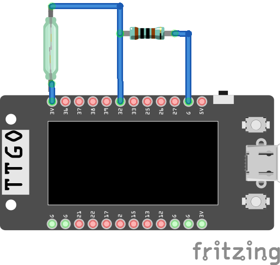
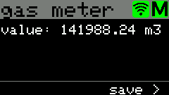
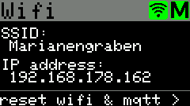
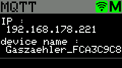
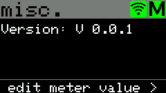
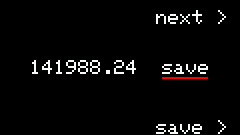
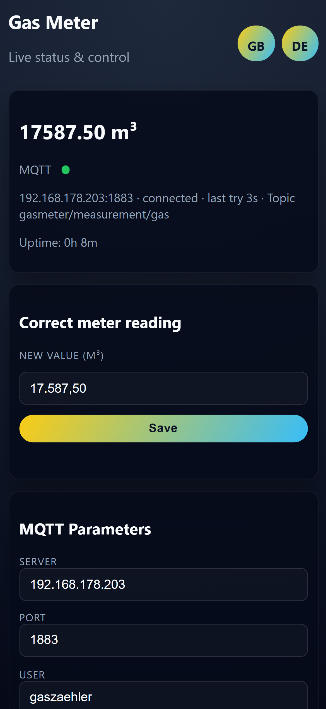

# Gas Meter (ESP32 TTGO T-Display)

> ⚠️ **Important Notice: This project contains substantial AI-generated code.** Review, test, and audit all firmware, web UI, and documentation before using it in production or safety-relevant contexts. Treat defaults and generated logic as untrusted until verified.

An ESP32 TTGO T-Display reads a reed switch on a diaphragm gas meter (e.g., BK-G4), counts pulses and publishes consumption via MQTT. It provides a small web UI (English/German), Home Assistant MQTT discovery (retained), and persists Wi-Fi/MQTT settings plus counter state in SPIFFS.

3D-printed enclosure by 3dFabrik: [Thingiverse](https://www.thingiverse.com/thing:5594161)

## Changelog
- **V 0.1.0**
  - UI: mobile tweaks, restart button, locale-aware input (comma/point), browser-driven language default (DE/EN toggle remains)
  - MQTT/HA: `device_class: gas`, retained discovery + availability, larger MQTT packet buffer, restart endpoint
  - Web UI: MQTT fields with autocomplete hints; inputs for clientID/topics; discovery resilience
- **V 0.0.2**
  - Home Assistant MQTT discovery (retained) + availability LWT
  - Persist `mqtt_clientid`, `mqtt_topic_gas`, `mqtt_topic_current` in SPIFFS
  - Web UI MQTT fields and language switch (EN/DE), default topics `measurement/gas`, `measurement/current`
  - MQTT robustness: TCP precheck, better logging; ArduinoJson switched to `DynamicJsonDocument`
- **V 0.0.1**
  - Wi-Fi reconnect added

## Features
- Pulse counting via reed switch, hysteresis for noise rejection
- TFT display with multiple views (Gas, Wi-Fi, MQTT, Misc, Edit meter)
- MQTT publishing with retained numeric state (`<clientID>/measurement/gas/state`) and Home Assistant discovery
- Configurable Wi-Fi and MQTT via web UI; settings and counter persisted to SPIFFS
- Web UI in English/German, mobile-friendly layout, restart button, OTA update form

## Hardware
- Diaphragm gas meter with magnetic pulse output
- Reed switch, 1 kΩ pull-down on GPIO32 to GND
- LilyGO TTGO T-Display (ESP32)
- Optional: 3D-printed case from Thingiverse link above

Wiring note: Reed contact to 3.3 V; GPIO32 pulled down with 1 kΩ. On rising edge the pulse is counted.



## Build
- Preferred: VS Code + PlatformIO. Import the project, adjust Wi-Fi/MQTT defaults if needed, then build & upload.
  ```
  platformio run --environment lilygo-t-display
  platformio run --target upload --environment lilygo-t-display
  platformio device monitor --environment lilygo-t-display
  ```
- Arduino IDE: uncomment the first line (`#include <Arduino.h>`), rename to `Gaszaehler.ino`.

## First-time setup (tzapu WiFiManager)
- Power on the device; no known Wi-Fi starts the captive portal `GaszaehlerAP`.
- Connect with phone/laptop to Wi-Fi `GaszaehlerAP` (open), the portal opens automatically (or browse to `192.168.4.1`).
- Choose "Configure WiFi", enter your Wi-Fi SSID/password. Optional: set static IP (leave DHCP if unsure).
- Save; the ESP32 reboots and joins your network. If it cannot connect, the portal reappears after timeout.
- Later resets: press the lower button on the Wi-Fi TFT page to forget Wi-Fi/MQTT and reopen the portal.

## Usage
### TFT screens
1) Gas: current total

   

2) Wi-Fi: SSID/IP, reset Wi-Fi/MQTT via lower button; opens AP `Gaszaehler-AP`

   

3) MQTT: broker IP and device name

   

4) Misc: firmware version, entry to edit meter value

   

5) Edit meter value locally (no MQTT required)

   

### Web UI (served by the device)
- Status card with MQTT state, uptime, current volume
- Adjust meter value
- MQTT settings (server/port/user/pass, clientID, topics), restart button, OTA upload
- Language toggle EN/DE; default follows browser language



### HTTP API (local)
- `GET /api/status` → JSON with MQTT/Wi-Fi state, topics, uptime, masked password, client ID, current reading.
- `POST /api/consumption` with `value` (m3, comma or dot) → sets meter value and saves.
- `POST /api/mqtt` with `server, port, username, password, clientid, topic, topic_current` → saves to SPIFFS, reconnects, republishes discovery.
- `POST /api/restart` → replies then restarts the ESP32.
- `POST /update` multipart form (field `firmware`) → OTA flash; device restarts on success.

### MQTT topics
- Human-readable: `<clientID>/<mqtt_topic_gas>` (default `measurement/gas`)
- Numeric retained state: `<clientID>/<mqtt_topic_gas>/state` (e.g., `Gaszaehler_ABC/measurement/gas/state`)
- Current value topic: `<clientID>/<mqtt_topic_current>` (default `measurement/current`)
- Availability (retained): `<clientID>/availability` with `online`/`offline`

### Home Assistant
- Discovery retained topics:
  - `homeassistant/sensor/<clientID>_gas_volume/config` (total, `device_class: gas`, `state_class: total_increasing`)
  - `homeassistant/sensor/<clientID>_current_value/config` (current, `device_class: gas`, `state_class: measurement`)
- State topic in discovery points to `<clientID>/measurement/gas/state`
- Availability wired to `<clientID>/availability`

### Edit meter value
- Via MQTT: publish to `<clientID>/measurement/current` (or legacy `<clientID>/gas_meter/currentVal`)
- Via display: go to “Edit meter value”, adjust, then save; cancels pulse counter to align with new offset.

### Persistence (SPIFFS)
- Stored: pulse counter, offset, Wi-Fi/MQTT credentials, clientID, topic bases
- Autosave interval and manual save via display button

## Alternatives
[ArduCounter](https://github.com/StefanStrobel/ArduCounter/) counts on multiple pins, supports displays, and integrates with FHEM; does not natively support MQTT.
