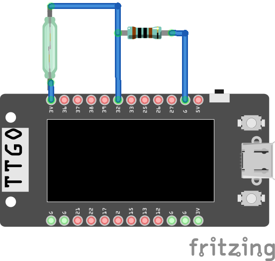
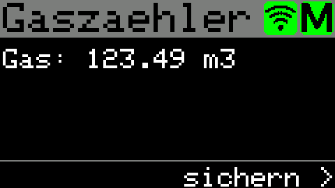
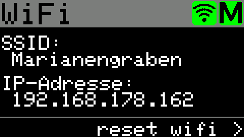
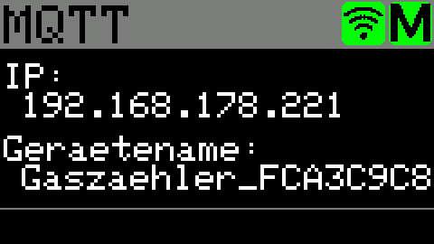

## Überblick des Gaszähler-Projekts
Das TTGO-T ESP32-Board mit integriertem Display kann für einen Standard Balken-Gaszähler (BK-G4) verwendet werden, der Impulse von einem Reed-Schalter zählt und die Daten über MQTT veröffentlicht. Dieses Projekt kombiniert Hardware-Schnittstellen, drahtlose Konnektivität und Datenprotokollierung zu einer IoT-Lösung für die Gasverbrauchsüberwachung.

Grundlage für dieses Projekt ist das 3d gedruckte Gehäuse von 3dFabrik von hier https://www.thingiverse.com/thing:5594161

### Hauptfunktionen:
- Erfassung von Impulsen eines Reed-Schalter-Sensors am Gaszähler 
- Anzeige der Gasverbrauchsdaten auf dem integrierten TFT-Bildschirm 
- Veröffentlichung von Gasverbrauchsmetriken an einen MQTT-Broker
- Konfigurierbare WLAN- und MQTT-Einstellungen 
- Dauerhafte Speicherung von Zählerdaten mittels SPIFFS 
- Tastenbedienung für verschiedene Anzeigemodi und Konfiguration

## Voraussetzungen
- Balkengaszähler mit Magnetimpulsgeber
- Gehäuse (z.B. https://www.thingiverse.com/thing:5594161)
- Reedkontakt
- 1k-Ohm Widerstand
- Lilygo TTGO T-Display (https://www.lilygo.cc/products/lilygo%C2%AE-ttgo-t-display-1-14-inch-lcd-esp32-control-board?variant=42159376433333)

### Hardware
Ich habe den Reed Kontakt entgegen vieler (online) Empfehlungen NICHT gegen GND, sondern gegen 3,3 Volt geschalten. 

Ds Schaltbild sieht also so aus:

GPIO32 wird also mit einem 1k-Ohm Pull-Down Widerstand mit Ground verbunden. 
Wenn der Reedkontakt mit einem Magnet geschlossen wird, hat GPIO32 eine Verbindung zu den 3,3 Volt.

### Kompilieren
Am einfachsten kann das Script mit VSCODE / PlatformIO genutzt werden. Dort einfach das Projekt importieren, WiFi und MQTT Angaben ergänzen und auf ein TTGO T-Display überspielen.

Eine Kompilierung mit der Arduino IDE ist auch möglich. hierzu muss die erste Zeile auskommentiert werden ("#include <Arduino.h>") und das Script in Gaszaehler.ino umbenannt werden.

## Benutzung
Das Display kann 3 verschiedene Seiten anzeigen, welche mit dem oberen Taster durchgeschalten werden:

Gaszähler, hier wird der aktuelle Zählerstand angezeigt.

Wifi, hier wird die SSID des Wifi-Netzwerks, sowie die aktuelle IP-Adresse angezeigt.
Mit der unteren Taste können die Wifi Einstellungen zurückgesetzt werden. Der ESP32-Gaszähler erstellt dann ein eigenes Wifi mit dem Namen "Gaszaehler-AP" (ohne Passwort). Hier kann dann das eigene Wifi-Netzwerk, sowie der MQTT Server eingetragen werden.

MQTT, hier wird die IP Adresse des MQTT Servers, sowie der Gerätename des Gaszählers angezeigt.
Der MQTT Server kann derzeit nur über das Wifi-Captive Portal geändert werden.

### MQTT
Das Projekt nutzt MQTT zur Veröffentlichung von Gasverbrauchsdaten. 
Das Skript erfasst lediglich die entdeckten Impulse. Der aktuelle Zählerstand wird durch einen Offset errechnet. 

Derzeit kann der aktuelle Zählerstand lediglich per MQTT verändert werden.
Hierzu muss der Gaszählerwert unter dem Topic "<GERÄTENAME>/gas_meter/currentVal" publiziert werden.
Der Gaszähler wird dann den internen den Impulszähler auf "0" setzen, und die folgenden Impulse zum gespeicherten Gaszählerwert addiert ausgeben.

### SPIFFS-Speicher
In regelmäßigen Abständen wird der aktuelle Zählerstand sowie die Wifi und MQTT Konfigurationsdaten gespeichert.
Das speichern kann auf dem Startbildschirm auch mit dem unteren Button erzwunden werden.

# TODO:
- ~~Mommentan funktioniert das Script nur, wenn WiFi und MQTT verbunden sind. Beides sollte sinnvollerweise optional sein.~~
- ~~evtl sollte der beliebte WiFi Manager von tzapu integriert werden, dann könnte ich ein vorkompiliertes binary zur Verfügung stellen, wenn WiFi und MQTT Server on the fly editiert werden können.~~
- Bessere Dokumentation (Zählerstand kann und sollte per MQTT gesetzt werden).
- ~~Sinnvolle Funktion für den zweiten Button.~~
- ~~Das Farbdisplay nutzen.~~
- ~~Mehr sinnvolle Ausgaben auf dem Display~~
- Skript für Zähler mit 1000 Impulsen je m³-Gas anpassen

## Alternativen
https://github.com/StefanStrobel/ArduCounter/ zählt an mehr als einem PIN, unterstützt auch das Display und ist stark mit FHEM (fhem.de) verknüpft. Leider keine Unterstützung für MQTT.