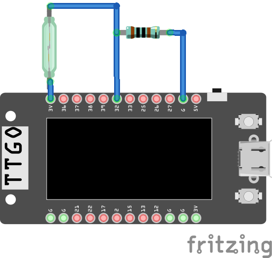
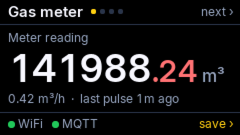
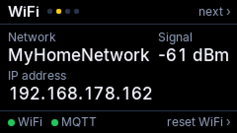
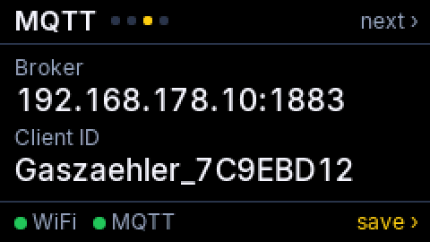
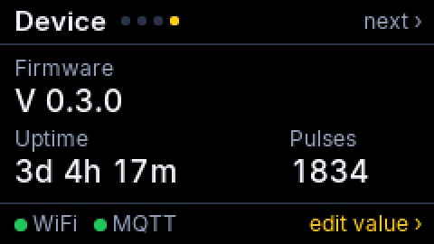
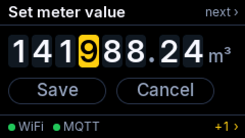
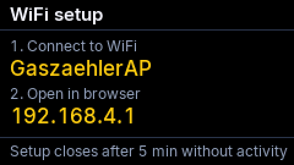
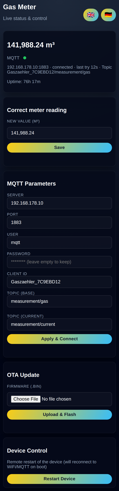

# Gas Meter (ESP32 TTGO T-Display)

> ⚠️ **Important Notice: This project contains substantial AI-generated code.** Review, test, and audit all firmware, web UI, and documentation before using it in production or safety-relevant contexts. Treat defaults and generated logic as untrusted until verified.

An ESP32 TTGO T-Display reads a reed switch on a diaphragm gas meter (e.g., BK-G4), counts pulses and publishes consumption via MQTT. It provides a small web UI (English/German), Home Assistant MQTT discovery (retained), and persists MQTT settings plus counter state in SPIFFS.

3D-printed enclosure by 3dFabrik: [Thingiverse](https://www.thingiverse.com/thing:5594161)

## Changelog
- **V 0.2.0**
  - New TFT layout (anti-aliased fonts, flow estimate, flicker-free), setup screen while the config portal is active, cancel option when editing the meter value
  - Optional web UI/OTA password (set in the config portal)
  - Home Assistant: `number` entity to set the meter reading (replaces the "current value" sensor)
  - Config portal timeout 300 s; dashboard and portal no longer compete for port 80
  - Web UI moved to `web/index.html`; screenshots of TFT and web UI are generated from the source (`tools/screenshots`)
  - Removed: serial RLE screenshot (long press) and `contrib/` decoder, replaced by the generated screenshots
- **V 0.1.1** (audit fixes)
  - Fix: autosave interval was 100 minutes instead of 10; state is now also saved before restart/OTA
  - Fix: buffer overflow on the "edit meter value" screen and in the WiFiManager parameter copy
  - Fix: retained or invalid MQTT correction values could reset the meter (now validated, retained message is cleared after use)
  - Fix: Home Assistant value lost its last digit above ~131072 m³ (float precision)
  - Fix: web UI interpreted a decimal point as thousands separator (factor 100); server validates input strictly
  - Fix: saving the MQTT form without retyping the password erased it; WiFiManager portal reset MQTT settings to compile-time defaults
  - Fix: invalid MQTT port caused a reboot loop
  - Security: CSRF protection for all state-changing endpoints incl. OTA; no plaintext password in serial log; no personal defaults in source
  - Wi-Fi reset on the display needs a second click to confirm; old Home Assistant entities are removed when the client ID changes
  - SPIFFS writes are power-loss safe (temp file + rename); library versions pinned; ArduinoJson 7
- **V 0.1.0**
  - UI: mobile tweaks, restart button, locale-aware input (comma/point), browser-driven language default (DE/EN toggle remains)
  - MQTT/HA: `device_class: gas`, retained discovery + availability, larger MQTT packet buffer, restart endpoint
  - Web UI: MQTT fields with autocomplete hints; inputs for clientID/topics; discovery resilience
- **V 0.0.2**
  - Home Assistant MQTT discovery (retained) + availability LWT
  - Persist `mqtt_clientid`, `mqtt_topic_gas`, `mqtt_topic_current` in SPIFFS
  - Web UI MQTT fields and language switch (EN/DE), default topics `measurement/gas`, `measurement/current`
  - MQTT robustness: TCP precheck, better logging; ArduinoJson switched to `DynamicJsonDocument`
- **V 0.0.1**
  - Wi-Fi reconnect added

## Features
- Pulse counting via reed switch, hysteresis for noise rejection
- TFT display: meter reading with flow estimate, Wi-Fi, MQTT and device pages, local editing of the meter value, setup instructions while the config portal is active
- MQTT publishing with retained numeric state (`<clientID>/measurement/gas/state`) and Home Assistant discovery (sensor + number entity to set the reading)
- Wi-Fi setup via captive portal; MQTT via portal or web UI; settings and counter persisted to SPIFFS
- Web UI in English/German, mobile-friendly layout, restart button, OTA update form, optional login

## Hardware
- Diaphragm gas meter with magnetic pulse output
- Reed switch, 1 kΩ pull-down on GPIO32 to GND
- LilyGO TTGO T-Display (ESP32)
- Optional: 3D-printed case from Thingiverse link above

Wiring note: Reed contact to 3.3 V; GPIO32 pulled down with 1 kΩ. On rising edge the pulse is counted.



## Build
- VS Code + PlatformIO: open the project, then build & upload. Wi-Fi and MQTT are configured on the device (see below), nothing needs to be edited in the source.
  ```
  platformio run --environment lilygo-t-display
  platformio run --target upload --environment lilygo-t-display
  platformio device monitor --environment lilygo-t-display
  ```
- The Arduino IDE is not supported: the build runs `scripts/embed_web.py` to embed the web UI and uses the local library `lib/ui`.

## First-time setup (tzapu WiFiManager)
- Power on the device; no known Wi-Fi starts the captive portal `GaszaehlerAP`.
- Connect with phone/laptop to Wi-Fi `GaszaehlerAP` (open), the portal opens automatically (or browse to `192.168.4.1`).
- Choose "Configure WiFi", enter your Wi-Fi SSID/password. Optional: set static IP (leave DHCP if unsure).
- The portal also asks for the MQTT server, port, user and password (leave the password empty to keep the stored one).
- Optional: set a **web UI password** in the portal. The dashboard and OTA then require a login (user `admin`, HTTP Digest auth). Leave it empty to keep the current setting.
- Save; the ESP32 joins your network. The portal closes after 300 s without activity; power-cycle the device to open it again.
- While the portal is active the dashboard is not served (both use port 80); it starts automatically once Wi-Fi is connected and the portal is closed.
- Later resets: on the Wi-Fi TFT page press the lower button twice (within 3 s) to forget Wi-Fi **and the web UI password** and reopen the portal. MQTT settings are kept.

## Usage
### TFT screens
The upper button (next to the top-right corner) cycles through the pages, the lower button triggers the action shown at the bottom right.

| | |
|---|---|
| <br>**Gas:** meter reading, flow estimate, time since last pulse. Lower button: save & publish | <br>**WiFi:** network, signal, IP. Lower button twice: reset Wi-Fi |
| <br>**MQTT:** broker and client ID (errors are shown in red) | <br>**Device:** firmware, uptime, pulses. Lower button: edit meter value |
| <br>**Edit meter value:** upper button moves the cursor, lower button increments the digit | <br>**WiFi setup:** shown while the config portal is active |

### Web UI (served by the device)
- Status card with MQTT state, uptime, current volume
- Adjust meter value
- MQTT settings (server/port/user/pass, clientID, topics), restart button, OTA upload
- Language toggle EN/DE; default follows browser language



### HTTP API (local)
All `POST` endpoints require the header `X-Requested-With: gaszaehler` (CSRF protection); requests without it are rejected with `403`. If a web UI password is set, all endpoints require HTTP Digest (or Basic) auth with user `admin`.

- `GET /api/status` → JSON with MQTT/Wi-Fi state, topics, uptime, masked password, client ID, current reading.
- `POST /api/consumption` with `value` (m3, e.g. `12345.67` or `12345,67`, max `999999.99`) → sets meter value and saves.
- `POST /api/mqtt` with `server, port, username, password, clientid, topic, topic_current` → saves to SPIFFS, reconnects, republishes discovery. An empty `password` keeps the stored one (unless `username` is empty, then it is cleared).
- `POST /api/restart` → replies then restarts the ESP32.
- `POST /update` multipart form (field `firmware`) → OTA flash; device restarts on success.

### MQTT topics
All values in m³ with two decimals (e.g. `141988.24`), published every 60 s and right after every correction.
- State (retained): `<clientID>/<mqtt_topic_gas>/state` (e.g. `Gaszaehler_ABC/measurement/gas/state`)
- Same value, not retained (kept for compatibility with older setups): `<clientID>/<mqtt_topic_gas>` (default `measurement/gas`)
- Correction (command) topic, subscribed: `<clientID>/<mqtt_topic_current>` (default `measurement/current`)
- Availability (retained): `<clientID>/availability` with `online`/`offline`

### Home Assistant
- Discovery retained topics:
  - `homeassistant/sensor/<clientID>_gas_volume/config` (total, `device_class: gas`, `state_class: total_increasing`)
  - `homeassistant/number/<clientID>_meter_set/config` (number entity to set the meter reading; writes to `<clientID>/<mqtt_topic_current>`, shows the current total)
- State topic in discovery points to `<clientID>/<mqtt_topic_gas>/state`
- Availability wired to `<clientID>/availability`

### Edit meter value
- Via Home Assistant: the number entity "Set Meter Reading".
- Via MQTT: publish the new value in m³ (e.g. `12345.67`) to `<clientID>/<mqtt_topic_current>`. Invalid values are ignored; the device clears a retained message on this topic after applying it.
- Via web UI: card "Correct meter reading".
- Via display: Device page → lower button, set the digits, then select "Save" (or "Cancel").

### Persistence
- SPIFFS (`/data.json`): pulse counter, offset, MQTT server/port/user/password, client ID, topics, web UI password
- Wi-Fi credentials are stored by WiFiManager in the ESP32's NVS
- Saved every 10 minutes (only if something changed), before restart/OTA, after configuration changes and via the "save" button on the gas page

## Development
- `src/main.cpp`: firmware logic (pulse counting, MQTT, web server, buttons)
- `lib/ui/`: display layouts and a small RGB565 framebuffer library with anti-aliased fonts. It has no Arduino dependencies, so the screens can be rendered on a PC.
- `web/index.html`: web UI; `scripts/embed_web.py` gzips it into the firmware at build time (generated header in `include/generated/`, not committed)
- `tools/fontgen/`: regenerates the font headers in `lib/ui/fonts/` from the [Inter](https://rsms.me/inter/) font (SIL Open Font License 1.1)

### Screenshots
All images in `img/` (except the schematic) are generated from the source code, no device needed:
```
cd tools/screenshots
npm ci && npx playwright install chromium   # once
npm run all                                 # TFT screens (C++ on the PC) + web UI (headless Chromium)
```
- TFT: `lcd_screenshots.py` compiles `lib/ui` together with `render_lcd.cpp` (example data for every screen) using the local C++ compiler and writes `img/lcd-*.png` (pixel-exact, 2× scaled).
- Web: `web_screenshots.js` opens `web/index.html` with the device API mocked from `status.fixture.json` and writes `img/web-*.png`.
- CI runs the same scripts on every push and uploads the images as the `screenshots` artifact.

## Alternatives
[ArduCounter](https://github.com/StefanStrobel/ArduCounter/) counts on multiple pins, supports displays, and integrates with FHEM; does not natively support MQTT.
